# Portfolio polish review — September 30, 2026

Review branch: `portfolio/astra-polish-review-2026-09-30`

Baseline: `main` at `c0035a7eeefc7e02ccea796640980968fbd5cba1`.

This is a comparison proposal. Nothing has been merged or deployed. Screenshots are actual browser renders of the baseline and review branch, captured at the same viewport sizes; they are not mockups or new project evidence.

## Design decisions

| Change | Reason |
| --- | --- |
| Deep-green Monte Carlo feature, larger project title, and a separate metric column | Makes the primary research project visibly primary. System stays below it on the homepage. |
| Restrained dot/grid backgrounds; green project heroes with saffron accents | Connects the visual identity to analytical and systems work without inventing data graphics or adding animation. |
| A continuous evidence strip, quieter principle cards, consistent card-link alignment | Separates evidence, approach, and reading choices instead of giving every block the same elevated-card treatment. |
| Serif article titles; restrained rules and more consistent prose spacing | Gives writing an editorial identity while keeping navigation and body typography consistent. |
| Mobile navigation menu and active parent-section states | Fixes the previous hidden mobile navigation and keeps location clear inside individual case studies/articles. Search and Resume stay visible. |
| Collapsible “On this page” indexes | Makes deep material easier to scan and revisit without removing any of it. |
| Search index prepared once, unchanged-query render caching, animation-frame scheduling, removal of overlapping blur layers | Reduces avoidable scripting/compositing work while preserving the header-dropdown interaction. No artificial debounce delay. Device-level performance improvement is not quantified. |
| Search keyboard navigation, focus restoration, accurate result counts, slash-separated capability queries, title-prefix ranking | Makes search work predictably for keyboard users and fixes empty results for DCF / FCFF, NPV / IRR / WACC, and SQL / PostgreSQL chips. |
| Search entries for existing CommuteWise, Database Systems, and Tableau work | Makes archive-only projects discoverable using their existing descriptions and ownership boundaries. System also appears under the archive's Data/Software filters. |
| Consistent focus rings, pressed states, touch targets, skip link, reduced-motion support | Makes interaction state visible across navigation, filters, models, and links. |
| Scrollable, keyboard-focusable diagrams/tables; chart-label space; green ranges and orange medians | Retains Figure 6's visual logic and all V5 values while improving legibility and matching the portfolio palette. |
| Clearer resume action spacing and document-specific accessible names | Prevents cramped Open/Download controls and distinguishes each document to assistive technology. |

## Before / after

Open an image to inspect it at full size. Desktop captures use 1440px width; phone captures use 390px.

| Current main | Review branch |
| --- | --- |
| 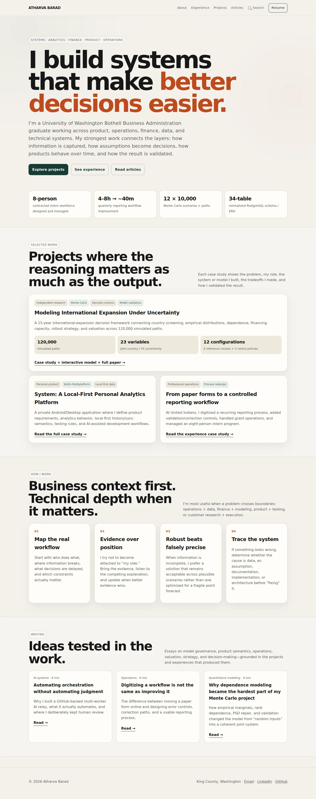 | 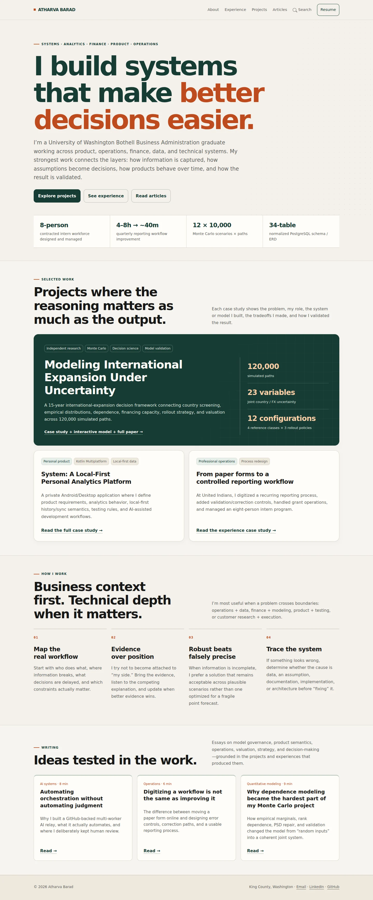 |
| 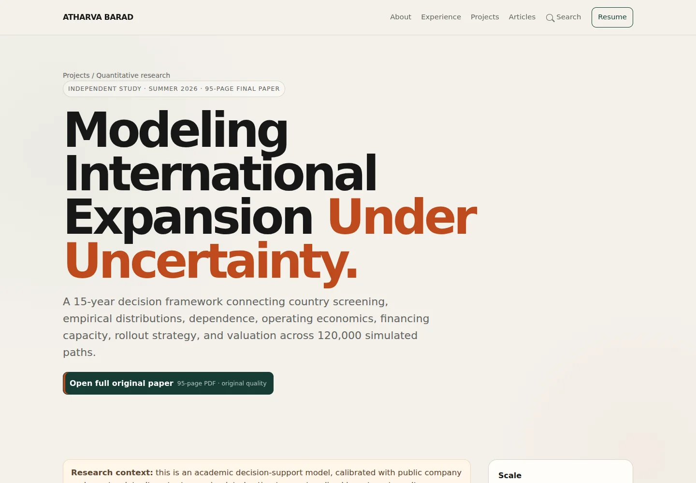 | 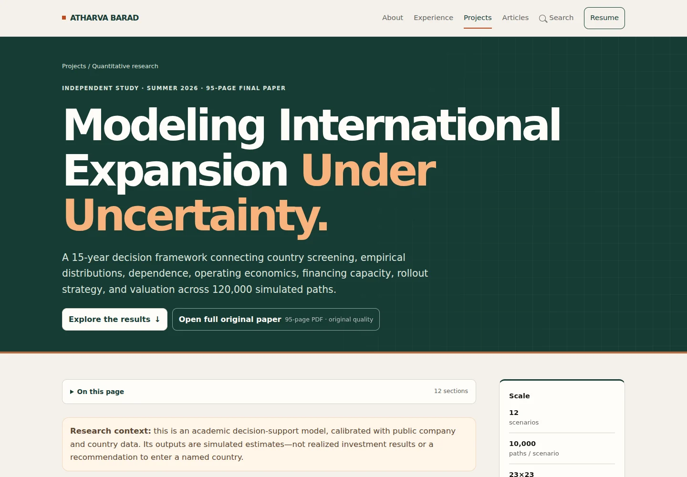 |
| 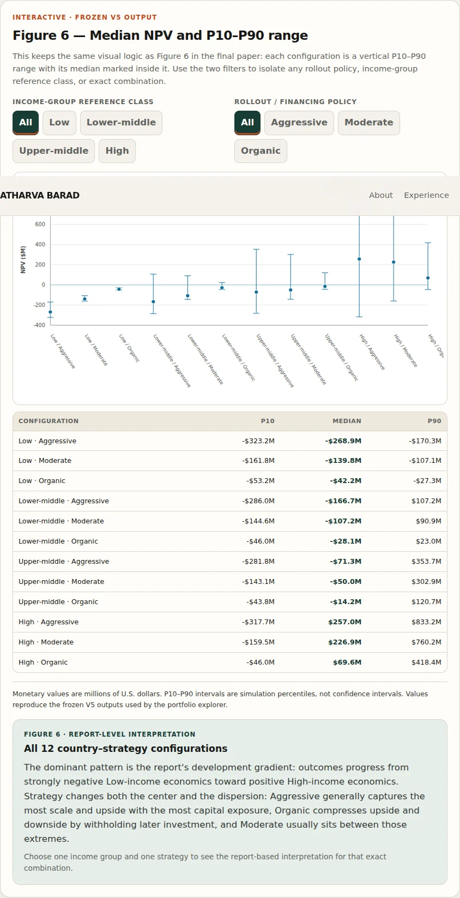 | 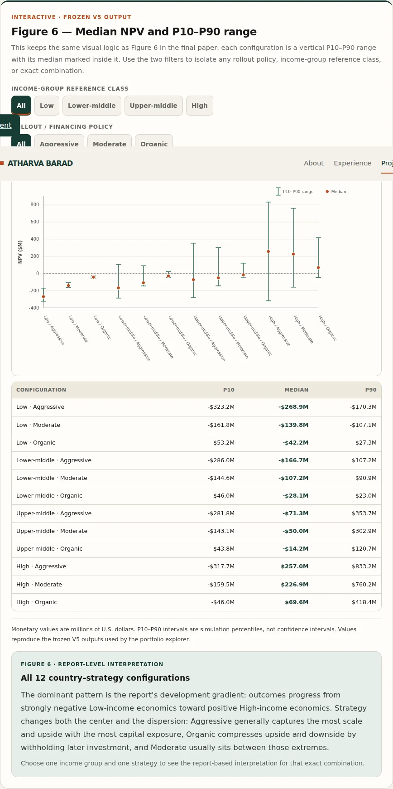 |
| 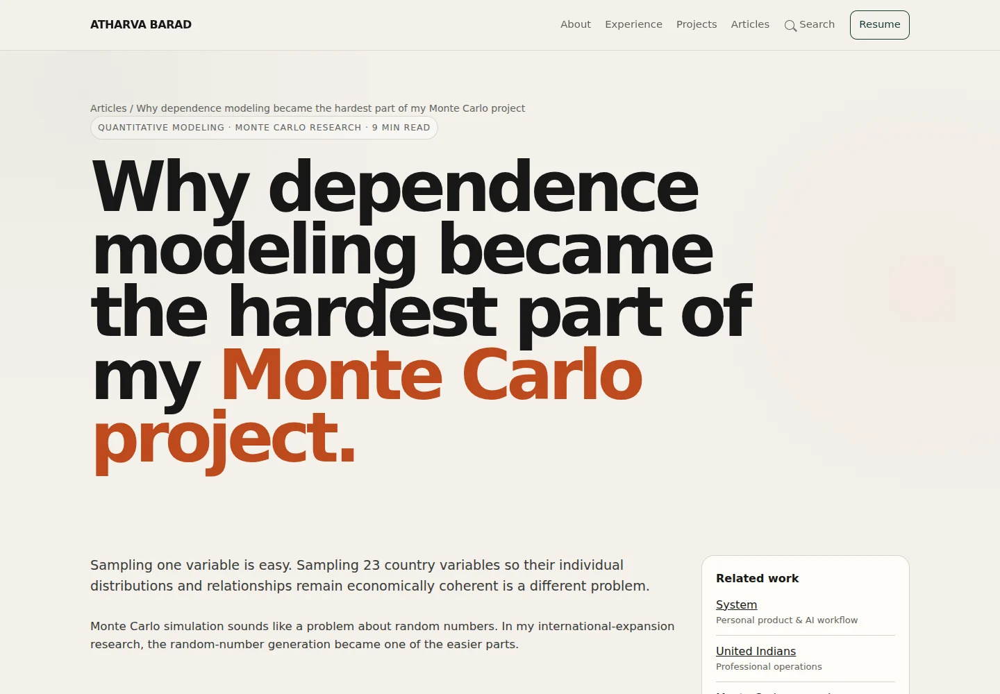 | 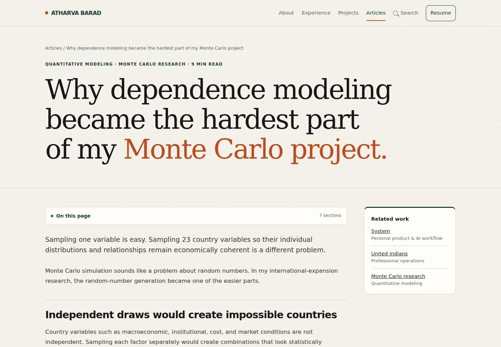 |
| 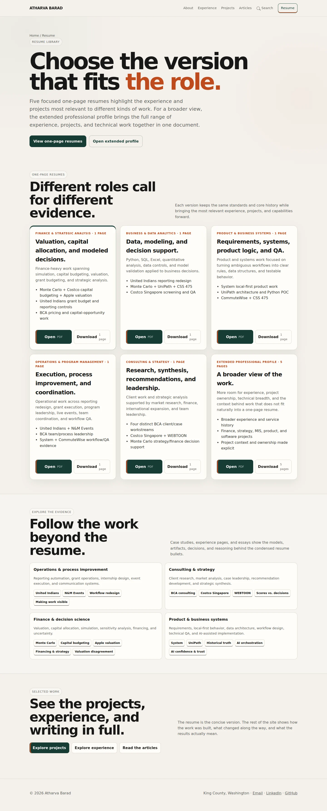 | 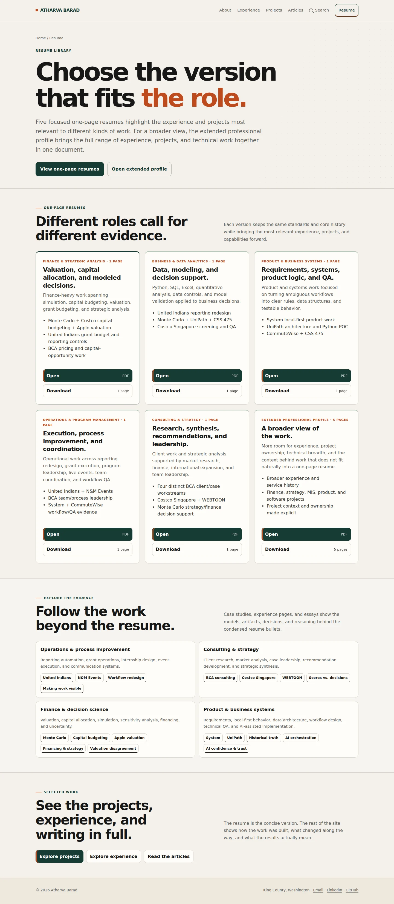 |
| 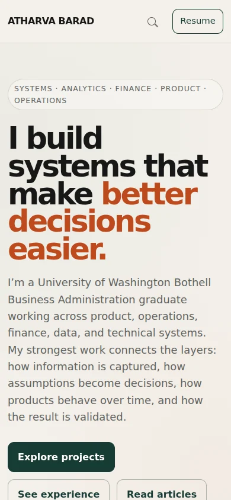 | 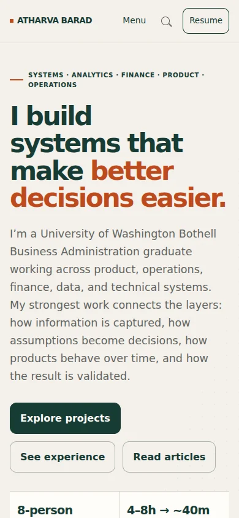 |

| Mobile menu | Mobile search |
| --- | --- |
| 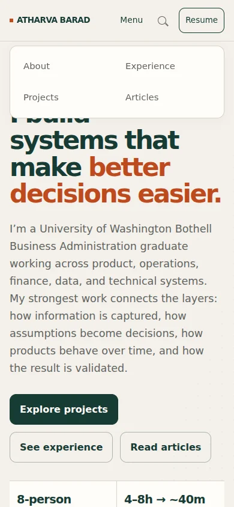 | 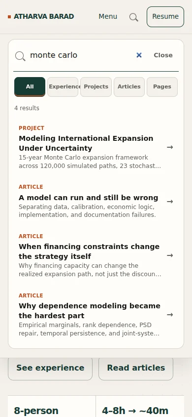 |

[Tablet project archive, 768px](2026-09-30/tablet-projects.webp)

## What stays intact

- All original page text, factual claims, ownership qualifications, and evidence caveats.
- Monte Carlo's primary homepage position, all frozen V5 numerical constants and explanations, Figure 6-style explorer, and full original research-paper PDF/link.
- All PDFs byte-for-byte, five curated one-page resumes, extended profile, and resume-generation code/rules.
- Related-writing links, education/credentials separation, capability-to-search connections, and site-wide search.
- Static HTML/CSS/JavaScript architecture. No site dependency, framework, font download, build step, tracking, or decorative animation was added.

## Tradeoffs and where main is stronger

- **Main has greater typographic uniformity.** Its all-sans treatment is consistent across every page. The serif article headings are a deliberate editorial distinction, not an objective correction.
- **Main's desktop resume buttons are more compact.** The review stacks Open and Download in the narrower three-column layout to prevent cramped labels, then uses side-by-side controls when cards have more room.
- **Main's Monte Carlo feature is denser.** The new feature uses more space to establish hierarchy. Readers who prefer a compact archive may prefer the original card.
- **Wide diagrams still require horizontal scrolling on phones.** Keeping their labels legible is preferable to shrinking the entire figure. Numeric values remain available as tables/cards.
- The new grids are decorative framing only. I deliberately avoided illustrative simulation curves, fake dashboards, invented screenshots, and animated charts that could be mistaken for evidence.
- I kept the existing portfolio language and case-study depth. The current version's restraint, clear evidence boundaries, and extensive cross-linking were already strong.

## Verification

The included `tools/review/verify-portfolio.cjs` checks the site using an ephemeral local HTTP server and an existing Playwright installation. It does not add dependencies to the published site.

- 30 pages at 1440, 1024, 768, 390, and 320px: 150 layout/search checks.
- 228 collected internal file/fragment targets, including dynamic section indexes and the three new archive anchors.
- Search availability on every page, all 15 capability chips, no-result recovery, type filtering, title ranking, arrow/Enter/Escape behavior, focus return, and mobile navigation.
- All 20 combinations of Monte Carlo filters, checking every rendered P10/median/P90 against unchanged source values.
- Capital-budgeting scenarios and sensitivity controls, country-weight reset, UniPath mode changes, and reporting-form modes.
- All six resume/profile Open popups and Download actions; PDF signatures and targets checked.
- Original HTML text retained in order; model constant blocks, all PDFs, and resume-generator source identical to baseline.
- Reduced-motion behavior and usable navigation with JavaScript disabled.
- No page-level horizontal overflow or console-breaking JavaScript errors in the tested Chromium browser.

These are Chromium browser checks, including emulated viewport sizes, plus visual inspection of desktop, tablet, and phone captures. Open-button checks verify a new window and the correct PDF request; the headless browser downloads PDFs rather than rendering a native PDF viewer. Physical-device keyboards, Safari, Firefox, and a complete screen-reader audit were not tested.

To inspect locally, check out this branch and run `python -m http.server 8000`, then open `http://localhost:8000`. This does not publish the site. To run the checks with Playwright already available: `node tools/review/verify-portfolio.cjs`; optional environment variables are documented at the top of that file. `PORTFOLIO_BASE_REF` can pin the preservation baseline.
